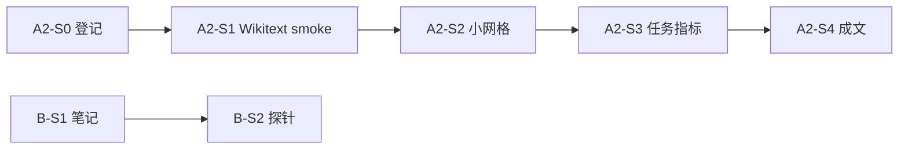

# 下一步研究计划（展开）

> **先读**：**`RESEARCH_STATUS_AND_DIRECTION.md`**（整体方向、现状、决策原则、**§6 公平性与何时换更大模型**、与本文件 **推荐顺序** 的对应）。  
> **前置**：阶段 1 已收束（**`PHASE1_MANUSCRIPT.md`**、**`results/metrics_result/`**、§7 复跑验收）。本文将 **`ROADMAP.md` 阶段 2 入口** 与 **`PROJECT_MASTER_PLAN.md`** 工作分解 **展开为可执行任务**；**周期勾选**仍以 **`CURRENT_SPRINT.md`** 为准。

---

## 1. 总目标（接下来 4–8 周）

在 **不推翻阶段 1 harness** 的前提下：

1. **系统线（A）**：真语料 **浅层树** + **同一 path reader 三对比** + **至少 1 个任务级指标**，使论文从「纯效率曲线」推进到「树 + 读者 + 简单任务」。  
2. **机制线（B）**：检索头 **探针 / 相关性分析**（可先在小模型或冻结主干上），产出 **可进附录** 的图表或表。  
3. **叙事与协议线（X）**：主文 **Figure 1** 定稿（含 PNG 是否入仓）；**§7.5 S5** 是否在截稿前补一行「同等试错轨迹」对照 — **视篇幅** 取舍。

三条线可 **并行**，硬依赖仅：**A 的 harness 稳定** 后，B/C 的「树上读路径」实验才好对齐叙事。

---

## 2. 轨道 A：阶段 2 — 真语料浅树 + 任务指标

### 2.1 原则

- **硬约束**：新树必须 **进入现有** `run_tree_reader_benchmark` / `benchmark_wikitext_tree.py` **同接口**；否则另开脚本须在 **EXPERIMENT_REGISTRY** 单列一行并声明 **与阶段 1 不可比**。  
- **软目标**：先 **Wikitext 扩展**，再考虑 **第二语料**（`prepare_leaves_from_corpus.py` + `benchmark_text_tree.py`）或 **层次聚类 / RAPTOR 式** 建树（仅当能导出 **平衡或规范化的遍历序**）。

### 2.2 里程碑（建议顺序）

| 代号 | 内容 | 产出 | 机器 |
|------|------|------|------|
| **A2-S0** | **登记占位**：新开 **EXPERIMENT_REGISTRY** 行（建议 id：`A-stage2-wikitext-grid-v1`），写清 **dim / fanout / chunk / num_leaves 上界 / HF 镜像** | 一行登记 + 可选 `TAG` 名 | — |
| **A2-S1** | **Smoke**：`benchmark_wikitext_tree.py` 固定 **num_leaves≤16**、**depth≤4**、与 **A-20260408-wikitext** 同 **dim=128**，输出 **JSON**（含 `git_sha`、torch 版本） | `results/metrics_result/benchmark_wikitext_*_stage2_smoke.json` | 5060 或 3090 |
| **A2-S2** | **小网格**：默认 **四格** `{8,16}×{8,12}`（与 5060 naive 动机同拓扑），**fused**；**`WARMUP`/`REPS`** 默认与 **paper_main** 一致（可 **`REPS=5`** 对齐 5060） | JSON + 汇总 CSV + manifest；**`SERVER_SWEEP_RUNBOOK.md` §2d** + **`run_server_stage2_wikitext_grid.sh`** | AutoDL |
| **A2-S2b** | **叶数扫描**：固定 **chunk_len**、**dim=128**，**`num_leaves ∈ {8,16,32,64}`**；**`run_server_wikitext_leavescale.sh`**（**`SERVER_SWEEP_RUNBOOK` §2f**）；登记 **A-stage2-wikitext-leavescale-v1** | 同 **A2-S2** harness；**TF** 为 **O(T²)** 整段 SA | AutoDL |
| **A2-S3** | **任务指标 +1**（择一落地）：<br>• **浅层路径分类**：给定叶对 / 节点对，预测是否同子树（需 **自动生成标签** 脚本）；<br>• **固定句填空 / 选词**：用叶块文本构造 **cloze**，读路径后 MLP 头预测（最小可用 **tiny LM 或池化+logreg**）；<br>• **检索式**：query → 哪片叶最相关（小候选集上的 **top-1 acc**）。 | **最小实现（v0）**：**`task_wikitext_path_pair.py`**（叶对 **同 cohort**、ridge on **concat(z_i,z_j)**；**`--pair-split leaf_heldout`** 减叶对泄漏；登记 **A-20260407-stage2-wikitext-path-pair**；**`PHASE2_DRAFT.md`** §2）。其余选项仍可用 notebook 另开。 | 48G 优先；**CPU/smoke** 可跑 v0 |
| **A2-S4** | **成文段落**：在 **`PHASE1_MANUSCRIPT.md`** 后续或新 **`PHASE2_DRAFT.md`** 写 **半页「真语料 + 任务」**；图注沿用 **`FIGURE_CAPTIONS_STAGE1.md`** 边界句式 | 文档 PR | — |

### 2.3 技术注意

- **叶块长度不一**：须在登记中固定 **tokenizer 截断长度** 与 **节点嵌入构造**（当前为确定性 hash 嵌入则写明 **非神经 encoder**）。  
- **与合成树对比**：正文写 **「同 harness、不同语料」**，避免把 Wikitext 点与 paper_main 合成点 **叠在同一张绝对坐标图** 除非 **归一化轴** 说明清楚。

### 2.4 建议首条命令（Smoke）

**`benchmark_wikitext_tree.py`** 默认仍 **打印 JSON 到 stdout**；归档时请使用 **`--out-json PATH`**（与 **`demo_tree_lm_minimal.py`** 一致写入 **`git_sha`**、**`torch_version`**）：

```bash
# 仓库根，conda activate mamba2；HF 不通时：
export HF_ENDPOINT=https://hf-mirror.com
mkdir -p results/metrics_result
STAMP=$(date -u +%Y%m%dT%H%MZ)

python scripts/benchmarks/benchmark_wikitext_tree.py \
  --num-leaves 8 --fanout 2 --chunk-len 8 --dim 128 \
  --warmup 2 --reps 5 \
  --out-json "results/metrics_result/benchmark_wikitext_stage2_smoke_${STAMP}.json"
```

（仍可用 shell 重定向代替 **`--out-json`**，但推荐后者以便 **父目录自动创建** 与 **与 stdout 同一份** 校验。）

**5060 CUDA 四格汇总表（本地）**：**`scripts/benchmarks/aggregate_wikitext_5060_cuda_grid.py`** → **`results/metrics_result/benchmark_wikitext_5060_cuda_grid_20260407.csv`**（与 **`PHASE2_DRAFT.md` §1.1** 配套）。

---

## 3. 轨道 B：检索头分析（`PROJECT_MASTER_PLAN` B）

### 3.1 目标

在 **固定小树或扁平块** 上，验证 **哪些层/头** 对「是否需要检索」或「路径位置」敏感，为后续 **注入（C）** 提供 **假设**。

### 3.2 里程碑

| 代号 | 内容 | 产出 |
|------|------|------|
| **B-S1** | 文献与设计空间 **半页**（Hidden Attention / RAD 等 **引用 + 本文差异**） | `docs/research/RETRIEVAL_HEAD_NOTES.md`（新建） |
| **B-S2** | **探针脚本**：对 **HF 小因果 LM** 或 **path reader 表征** 抽层向量，算与 **合成 / 随机标签** 的 **岭线性可分性**（对照 **random_label_control**） | `scripts/research/probe_retrieval_correlation.py` + **`--out-json`** |
| **B-S3** | **48G 窗口**：换 **更大 reader 或更深树** 复测 **趋势是否保持** | 登记新行 **B-stage2-probe-*** |

**依赖**：可与 **A2-S1** 并行；**不必**等任务指标 A2-S3。

---

## 4. 轨道 X：成文、图与 §7.5 S5

| 任务 | 说明 |
|------|------|
| **主图 PNG 入仓** | 若仓库策略允许，**`git add`** `mamba_3090_naive_vs_fused_dim*.png`；过大则 **网盘 + registry 外链** |
| **S5 汇总表** | `RESEARCH_NOTES` §7.5 **S5** 行：在 **同一 DFS 轨迹** 下对比 **SSM restore** vs **TF-R1** vs **TF-KV** 的 **wall-clock** — 需 **新脚本** 或 **把现有 JSON 合成一张表**；**截稿前**再判断是否值得 |
| **辅线 X-20260422–25** | 仅当审稿或导师要求 **「导航故事」** 时再加笔；**默认不增投** |

---

## 5. 依赖关系（简图）



---

## 6. 建议的最近两周（复制到 `CURRENT_SPRINT`）

1. **A2-S0**：**EXPERIMENT_REGISTRY** 新增 **`A-stage2-wikitext-grid-v1`**（或自定 id），填 **目的 + 指标列模板**。  
2. **A2-S1**：跑 **§2.4** smoke，**json** 入 **`results/metrics_result/`**，**git commit**。  
3. **B-S1**：新建 **`docs/research/RETRIEVAL_HEAD_NOTES.md`** 提纲（问题定义、与树导航的关系、不做什么）。

---

## 7. 修订记录

| 日期 | 说明 |
|------|------|
| 2026-04-09 | 初版：阶段 2 / 检索头 B / 成文与 S5 展开 |
| 2026-04-10 | **B-S2**：`probe_retrieval_correlation.py`；**RETRIEVAL_HEAD_NOTES** §2 文献入口表（2404.15574 / 2406.15765 / 2209.11895 / 2508.02184 / 2410.10819） |
| 2026-04-10 | **B-S2+**：`--label-mode topic`、`--topic-split heldout`（模板留出，避免句级划分虚高）；gpt2 归档 `probe_retrieval_linear_gpt2_topic_{heldout,sample}_cpu.json` |
| 2026-04-10 | **B-S2+ path reader**：`probe_path_reader_linear` 16 叶 heldout + 可选 BCE；**`--train-head-only`** 与全量微调分列 JSON |
| 2026-04-10 | **A2 本地**：5060 CUDA **`benchmark_wikitext_tree`** `n16×c8` / `n16×c12` 入 **`results/metrics_result/`**（与 3090 **不可混点**） |
| 2026-04-07 | **A2-S3 v0**：**`task_wikitext_path_pair.py`**（Wikitext 叶对同 cohort + ridge）；**`PHASE2_DRAFT.md`**；登记 **A-20260407-stage2-wikitext-path-pair** |
| 2026-04-07 | **A2-S3**：**`--pair-split leaf_heldout`**（train/test 叶不交）；归档 **`task_wikitext_sibling16_leafheldout4_{cpu,cuda5060}.json`** |
| 2026-04-07 | **§2.4**：**`aggregate_wikitext_5060_cuda_grid.py`**；**`path_pair_geometry` + test**；**A2-S3** `chunk_len=12` leaf_heldout |
| 2026-04-07 | **A2-S2 云端包**：**`run_server_stage2_wikitext_grid.sh`** + **`aggregate_wikitext_tree_json_grid.py`**（**`--base-dir`**）；**`SERVER_SWEEP_RUNBOOK` §2d** |
| 2026-04-07 | **A2-S2b** 叶数扫描 **`run_server_wikitext_leavescale.sh`**；§7 **depth 5–6** **`run_server_section7_depth_sweep.sh`**（**`SERVER_SWEEP_RUNBOOK` §2f–§2g**） |
| 2026-04-09 | **A2-S2b** 已归档：**`TAG=stage2_leavescale`** **`STAMP=20260409T1257Z`**；**`EXPERIMENT_REGISTRY` A-stage2-wikitext-leavescale-v1** |
| 2026-04-09 | **A2-S2b XL**：**`stage2_leavescale_xl`** **n128/n256** **`1322Z`/`1324Z`**；**A-stage2-wikitext-leavescale-xl-v1** |
