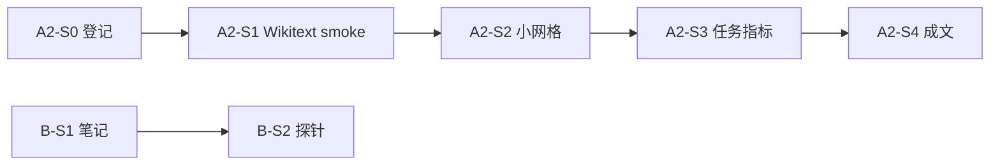

# 下一步研究计划（展开）

> **先读**：**`docs/overview/planning/RESEARCH_STATUS_AND_DIRECTION.md`**（整体方向、现状、**§3.5**、决策原则、**§6**、与本文件 **推荐顺序** 的对应）。  
> **前置**：阶段 1 已收束（**`docs/experiments/phases/PHASE1_MANUSCRIPT.md`**、**`results/metrics_result/`**、§7 复跑验收）。本文将 **`docs/overview/planning/PROJECT_MASTER_PLAN.md`** 工作分解 **展开为可执行任务**（**`docs/overview/planning/ROADMAP.md`** 仅保留 **阶段 2 入口指针**）；**周期勾选**仍以 **`docs/overview/execution/CURRENT_SPRINT.md`** 为准。

---

## 项目现状快照

**主线材料、完成度大表、六轴防混读**：**唯一权威** **`docs/overview/planning/RESEARCH_STATUS_AND_DIRECTION.md` §2–§3**（不在此重复表格）。**本机可复制命令**：**唯一权威** **`docs/environment/runbooks/LOCAL_5060_RUNBOOK.md`**。

### 1. 测试与仓库卫生

- **`pytest tests/`**（须 **`mamba2`** 等有 **torch** 的环境）：**20 passed**（全量；约 **15 s** 量级，以本机为准）。
- **`py -3 -m pytest tests/test_aggregate_ssgs_mamba_wikitext_json.py -q`**：**无 torch** 亦可跑（**2** 条），见 **`LOCAL_5060_RUNBOOK` §5**。
- **`git status`**：提交前自检应保持 **干净**；勿手改污染 **`metrics_result/`** 归档。

### 2. 须在 **3090 / AutoDL** 上完成的登记项（**P1–P3**）

**（2026-04 起服务器已恢复可用；以下按 **`docs/environment/runbooks/NEXT_EXPERIMENTS_COMMANDS.md`** 执行并新开登记行。）**

1. **B-S2+ CUDA**：**`probe_path_reader_linear.py`** **去掉 `--cpu`** 一条 JSON → **与 `PHASE1_MANUSCRIPT` §9.1 本机 CPU 分列**。  
2. **SSGS**：**`git pull` 后** **`demo_ssgs_mamba_wikitext.py` n8**（**c8 dim128**，与 grid 一致）刷新 **`git_sha`**。  
3. **SSGS n128** + **`aggregate_ssgs_mamba_wikitext_json.py`**（辅线，非阻塞）。

---

## 3. 正式开工：**Mamba + 树 + SSGS** 整合主线（**Phase M1**）

> **唯一详表**：**`docs/experiments/planning/SSGS_MAINLINE_M1.md`**（工具盘点、缺口、四周目标、检查表）。  
> **登记**：**`EXPERIMENT_REGISTRY.md`** **`X-ssgs-vs-kv-tree-nav-m1`**。  
> **Harness（已落地）**：**`benchmark_ssgs_vs_kv_tree_nav_wikitext.py`**（**`kind=ssgs_vs_kv_tree_nav_wikitext`**）— **Mamba** + **TF-KV clone** + **TF-KV truncate_kv**；**`run_m1_ssgs_vs_kv_wikitext_cuda.sh`**；可选 **`--l3-tf-kv-hidden`** / **`--l3-tf-kv-downstream-ce`**。  
> **归档摘要**：多 **STAMP** 的 **`ssgs_vs_kv_tree_nav_wikitext_*.json`**；汇总 **`results/metrics_result/ssgs_vs_kv_wikitext_nav_grid.csv`**（**`aggregate_ssgs_vs_kv_wikitext_json.py`**）。**L3** 与 **n8/n16/n32** 实测见 **`SSGS_MAINLINE_M1.md`** §2.1。

**已完成（相对 2026-04-10 稿）**：**同 Wikitext 建树、同 DFS 任务**下的 **三臂统一 JSON**、**叶扫**、**隐状态 L3**、**固定叶头 CE（下游 L3）**、**网格 CSV** 与 **登记册** 更新。  
**可选后续**：**n64** 一格、**`git pull` 后** 刷新 **`git_sha`**；**训练型子头 / 树 LM 对齐** 须 **另 `kind`**（见 **`SSGS_MAINLINE_M1.md`** 检查表）。**成文**：在 **`FIGURE_CAPTIONS_STAGE1.md`** / **`PHASE1_MANUSCRIPT` §5.1** / **`SUBMISSION_PACK` §A2–A3** 写入 **M1 为独立测量轴**，**禁止**与 path-batch、§7 毫秒列、**仅 SSGS 计数** demo **无脚注混读**。

**与 P0/P1 关系**：**P0 成文** 与 **M1 实测收尾（可选 n64 等）** **并行**。**P1 B-S2+ CUDA** 仍为 **检索副线**；**P2** SSGS **n128 / sha** **非** M1 阻塞。

---

## 后续方向（推荐优先级）

| 优先级 | 内容 | 说明 |
|--------|------|------|
| **P0** | **成文整合** | **`PHASE1_MANUSCRIPT`** / **`FIGURE_CAPTIONS_STAGE1`** / **`EXPERIMENT_REGISTRY`** 对齐投稿版；**§7.5 S5** 总表 **视截稿篇幅** |
| **M1** | **SSGS 整合对照（主线科研）** | **`SSGS_MAINLINE_M1.md`**：**harness 已归档**（**`X-ssgs-vs-kv-tree-nav-m1`**）；**L3** 见 **`RESEARCH_STATUS` §3.5**；成文须 **单列脚注**（**`FIGURE_CAPTIONS_STAGE1.md`** **第六轴**） |
| **P1** | **3090：B-S2+ CUDA 一条** | **在 3090 上执行**；与 **本机 B-S2+ CPU** **分列**；**`NEXT_EXPERIMENTS_COMMANDS.md` §6**；**副线** |
| **P2** | **SSGS 辅线** | **sha 刷新**、**n128**；**非** M1 阻塞 |
| **P3** | **A2-S3 可选加压** | **云端或本机 CPU**（视脚本）；与 **init×5** **分列** 说明 |
| **P★** | **（可选）L3 语义加细** | **M1** 已含 **隐状态 + 固定头 CE**；**训练型探针** 另 **`kind`**；**`RESEARCH_STATUS` §3.5** |

**默认里程碑顺序（2026-04-11 起）**

1. **P0 成文** 与 **M1 叙事入稿**（**第六轴脚注**）**并行**。  
2. **M1 可选实测**：**n64** / **`git_sha` 刷新**；**不**阻塞 **P0** 冻结。  
3. **3090**：**P1 B-S2+ CUDA** 与 **P2** 辅线 **按周交错**；**M1** 新跑次 **非**必须。  
4. **P3**、**P★**（**训练型 L3**）仍 **可选**。

**原则**：**不**在无脚注下混表 **5060 naive** 与 **3090 fused**；**不**混读 **path-batch 毫秒/峰值**、**§7 单列毫秒**、**SSGS 快照计数**、**A2-S3 准确率**、**M1 三臂 DFS 对照**（**`PHASE1_MANUSCRIPT` §5.1** + **`FIGURE_CAPTIONS_STAGE1.md`** **六轴表** + **`SSGS_MAINLINE_M1.md`**）。**§3.5** 证据层级：**M1** 目标 **L3**，**不**跳级写成 L4 Agent。

---

## 算力不可用时的备选推进（成文 + 本机可执行）

**定位**：**仅当 AutoDL/3090 暂时不可用时** 使用；按 **`docs/overview/planning/RESEARCH_STATUS_AND_DIRECTION.md` §4–§5** 与 **`PROJECT_MASTER_PLAN`** 的 **正常节奏** 推进；**不**把 **P★** 插入本段。**服务器可用时** 以 **§2「须在 3090 上完成的登记项」** 与 **`docs/environment/runbooks/NEXT_EXPERIMENTS_COMMANDS.md`** 为主。

### A. 成文（P0，优先）

**成文包（A1–A4 正文与脚注草稿）**：**`docs/overview/execution/SUBMISSION_PACK.md`**（一页故事线、路径核对表、可粘贴边界句、检索头短段；**§A1b** 摘要/引言草稿）。

| 顺序 | 任务 | 产出/自检 |
|------|------|-----------|
| **A1** | **主叙事一页** | **`SUBMISSION_PACK.md` §A1**；摘要/引言句见 **§A1b** |
| **A2** | **数字与路径核对** | **`SUBMISSION_PACK.md` §A2** + 全表补扫 **`PHASE1_MANUSCRIPT` §5.1** |
| **A3** | **六轴脚注成句** | **`SUBMISSION_PACK.md` §A3**；完整表见 **`FIGURE_CAPTIONS_STAGE1.md`** |
| **A4** | **检索头边界** | **`SUBMISSION_PACK.md` §A4**；全文见 **`PHASE1_MANUSCRIPT` §9** |
| **A5** | **（可选）§7.5 S5** | 视截稿；**非**阻塞 |

### B. 本机可补的实验（**非**必须；仅当成文需要「附录多一行」）

**环境**：**`docs/environment/runbooks/LOCAL_5060_RUNBOOK.md`**；解释器 **`mamba2`**。**登记**：新 JSON 须 **`docs/experiments/planning/EXPERIMENT_REGISTRY.md` 新行**。

| 顺序 | 内容 | 说明 |
|------|------|------|
| **B1** | **`probe_retrieval_correlation.py --cpu`** | **B-S2** 附录；**`RETRIEVAL_HEAD_NOTES.md` §2**；与 path-batch **分列** |
| **B2** | **`benchmark_mamba2_cache_snapshot_segments.py --device cpu`** | §7 **S1** 本机复现/更新 JSON（与 **`docs/environment/runbooks/SERVER_SWEEP_RUNBOOK.md`** 协议一致） |
| **B3** | **`pytest tests/`** | **20 passed** 量级；提交前 **smoke** |

**已跑满时不必重复**：本机 **B-S2+**、**A2-S3 n8**、**Wikitext CPU/CUDA smoke**、**SSGS 轻量** 等见 **「本机 5060 已完成」** 清单。

### C. 算力恢复后

**P1** B-S2+ CUDA、**P2** SSGS sha / n128 —— **原顺序不变**，见上文 **§2** 与 **「当前收口清单」** 中 **「服务器有空时」** 列表。

---

## 当前收口清单（工作台整理；与 **`PHASE1_MANUSCRIPT.md` §10** 对齐）

**成文（优先，不占 GPU）**

- [x] **归档路径核对**：见 **`PHASE1_MANUSCRIPT.md` §5.1** + **`SUBMISSION_PACK.md` §A2**（主图 PNG、**`paper_main_*` CSV**、§7、5060、阶段 2 **含 `dim256` `0847Z`**、A2-S3 **含 TSV**、SSGS **11 行 grid**、**M1** **`ssgs_vs_kv_wikitext_nav_grid.csv`**）；六轴图注见 **`FIGURE_CAPTIONS_STAGE1.md`**。
- [x] **分列脚注规则**：已写入 **`PHASE1_MANUSCRIPT` §5.1**（**5060/3090**、**naive/fused**、**path-batch / §7 / SSGS / A2-S3**）；正式投稿前将对应句式 **粘贴进论文正文/附录** 即可。
- [ ] **§7.5 S5** 总表是否补 —— **视截稿篇幅**（主图 PNG **已入仓** 三张 **`mamba_3090_naive_vs_fused_dim{128,256,384}_*.png`**）。

**仓库与数据 hygiene**

- [x] **`git status`** 干净（提交前自检；更新本快照时 **已验证**）；勿让 Excel/手改 **污染** 已归档 **`benchmark_wikitext_stage2_*`** / **`…leavescale_xl_*`**（误改用 **`git restore results/metrics_result/<file>`** 回滚）。
- [x] **SSGS Wikitext**：以 **`ssgs_mamba_wikitext_grid.csv`** + **`ssgs_mamba_wikitext_*.json`** 为准；**勿**保留 **`…grid-Copy1.csv`** 等重复副本。

**本机 5060 已完成（2026-04-10；与登记册、`PHASE1_MANUSCRIPT` §4/§5/§8.2 对齐）**

- [x] **A2-S3**：**`task_wikitext_path_pair.py`** **`--cpu --num-leaves 8`**，**sibling**、**stratified**、**c8 dim128** → **`results/metrics/task_wikitext_sibling8_local5060_cpu_20260410.json`**（**X-20260410-local5060-a2s3-n8-strat**；**`ridge_concat.*.test_acc`≈0.857**，7 test 对）。
- [x] **SSGS × Wikitext（轻量）**：**`demo_ssgs_mamba_wikitext.py`** **`--cpu`** **n8 c4 dim64** → **`results/metrics/ssgs_mamba_wikitext_n8_c4_d64_local5060_20260410.json`**（**X-20260410-local5060-ssgs-wikitext-n8-c4d64**；**snapshots 7 / rollbacks 11 / leaf_checks 8**）。与 **`metrics_result` 归档 grid（c8 dim128）** **分列**。
- [x] **B-S2+ BCE 50 步（本机）**：**`probe_path_reader_linear_text16_heldout_train50_local5060.json`**（**X-20260410-local5060-bs2plus-train50-n16**；与 **`LOCAL_5060_RUNBOOK` §2** 可选行一致）。
- [x] **Wikitext path-batch CPU smoke**：**`benchmark_wikitext_local5060_cpu_20260410T1220Z_n8_c8.json`**（**`WARMUP=1` `REPS=2`**；**X-20260410-local5060-wikitext-cpu-n8c8**）。
- [x] **回归**：**`pytest tests/test_aggregate_ssgs_mamba_wikitext_json.py`**（**2** passed，**`py -3`** 可无 torch）；**`pytest tests/`** 全量（**20** passed，**`mamba2` Python**，约 **15 s**）。

**服务器有空时（可选一条即可；建议优先级自上而下）**

1. **Phase M1**：**SSGS vs KV/重算** 同树 harness —— 见 **`docs/experiments/planning/SSGS_MAINLINE_M1.md`**；产出 **新 JSON `kind`** + **`EXPERIMENT_REGISTRY` 登记**。  
2. **B-S2+ CUDA（3090）** — **副线**：**`probe_path_reader_linear.py`** **去掉 `--cpu`**（**`NEXT_EXPERIMENTS_COMMANDS.md` §6**）；与 **本机 CPU** **分列**。  
3. **`git pull` 后** **`demo_ssgs_mamba_wikitext.py` n8 一格** 刷新 **`git_sha`**。  
4. **SSGS n128** + **`aggregate_ssgs_mamba_wikitext_json.py --append`** — **辅线**（**`NEXT_EXPERIMENTS_COMMANDS.md` §10**）。

**已就绪（无需再跑也能写）**：阶段 2 **path-batch**（**A2-S2**、**dim256 `1137Z`+`0847Z`**、叶数扫描与 XL、**§7 depth 5–6**）、**A2-S3**（**1438Z** + **0820Z/0850Z** + **TSV**）、**Wikitext SSGS**（**`ssgs_mamba_wikitext_grid.csv` 11 行**）—— 见 **登记册**、**`SUBMISSION_PACK` §A2/A2.1/A8**、**`PHASE1_MANUSCRIPT` §5**。

**M1 开工清单**（与 **§3** 一致）：见 **`docs/experiments/planning/SSGS_MAINLINE_M1.md` §4**。

**本机 5060 可复制命令**（含 B-S2+ / Wikitext / SSGS / §7 CPU）：**唯一权威** **`docs/environment/runbooks/LOCAL_5060_RUNBOOK.md`**；**勿**在此文件维护第二份命令表。

---

## 1. 总目标（接下来 4–8 周）

在 **不推翻阶段 1 harness** 的前提下：

1. **系统线（A）**：真语料 **浅层树** + **同一 path reader 三对比** + **至少 1 个任务级指标**，使论文从「纯效率曲线」推进到「树 + 读者 + 简单任务」。  
2. **机制线（B）**：检索头 **探针 / 相关性分析**（可先在小模型或冻结主干上），产出 **可进附录** 的图表或表。  
3. **叙事与协议线（X）**：主文 **Figure 1** 定稿（含 PNG 是否入仓）；**§7.5 S5** 是否在截稿前补一行「同等试错轨迹」对照 — **视篇幅** 取舍。

三条线可 **并行**，硬依赖仅：**A 的 harness 稳定** 后，B/C 的「树上读路径」实验才好对齐叙事。

---

## 2. 轨道 A：阶段 2 — 真语料浅树 + 任务指标

### 2.1 原则

- **硬约束**：新树必须 **进入现有** `run_tree_reader_benchmark` / `benchmark_wikitext_tree.py` **同接口**；否则另开脚本须在 **EXPERIMENT_REGISTRY** 单列一行并声明 **与阶段 1 不可比**。  
- **软目标**：先 **Wikitext 扩展**，再考虑 **第二语料**（`prepare_leaves_from_corpus.py` + `benchmark_text_tree.py`）或 **层次聚类 / RAPTOR 式** 建树（仅当能导出 **平衡或规范化的遍历序**）。

### 2.2 里程碑（建议顺序）

| 代号 | 内容 | 产出 | 机器 |
|------|------|------|------|
| **A2-S0** | **登记占位**：新开 **EXPERIMENT_REGISTRY** 行（建议 id：`A-stage2-wikitext-grid-v1`），写清 **dim / fanout / chunk / num_leaves 上界 / HF 镜像** | 一行登记 + 可选 `TAG` 名 | — |
| **A2-S1** | **Smoke**：`benchmark_wikitext_tree.py` 固定 **num_leaves≤16**、**depth≤4**、与 **A-20260408-wikitext** 同 **dim=128**，输出 **JSON**（含 `git_sha`、torch 版本） | `results/metrics_result/benchmark_wikitext_*_stage2_smoke.json` | 5060 或 3090 |
| **A2-S2** | **小网格**：默认 **四格** `{8,16}×{8,12}`（与 5060 naive 动机同拓扑），**fused**；**`WARMUP`/`REPS`** 默认与 **paper_main** 一致（可 **`REPS=5`** 对齐 5060） | JSON + 汇总 CSV + manifest；**`SERVER_SWEEP_RUNBOOK.md` §2d** + **`run_server_stage2_wikitext_grid.sh`** | AutoDL |
| **A2-S2b** | **叶数扫描**：固定 **chunk_len**、**dim=128**，**`num_leaves ∈ {8,16,32,64}`**；**`run_server_wikitext_leavescale.sh`**（**`SERVER_SWEEP_RUNBOOK` §2f**）；登记 **A-stage2-wikitext-leavescale-v1** | 同 **A2-S2** harness；**TF** 为 **O(T²)** 整段 SA | AutoDL |
| **A2-S3** | **任务指标 +1**（择一落地）：<br>• **浅层路径分类**：给定叶对 / 节点对，预测是否同子树（需 **自动生成标签** 脚本）；<br>• **固定句填空 / 选词**：用叶块文本构造 **cloze**，读路径后 MLP 头预测（最小可用 **tiny LM 或池化+logreg**）；<br>• **检索式**：query → 哪片叶最相关（小候选集上的 **top-1 acc**）。 | **最小实现（v0）**：**`task_wikitext_path_pair.py`**（叶对 **同 cohort**、ridge on **concat(z_i,z_j)**；**`--pair-split leaf_heldout`** 减叶对泄漏；登记 **A-20260407-stage2-wikitext-path-pair**；**`PHASE2_DRAFT.md`** §2）。其余选项仍可用 notebook 另开。 | 48G 优先；**CPU/smoke** 可跑 v0 |
| **A2-S4** | **成文段落**：在 **`PHASE1_MANUSCRIPT.md`** 后续或 **`docs/experiments/phases/PHASE2_DRAFT.md`** 补 **半页「真语料 + 任务」**；图注沿用 **`FIGURE_CAPTIONS_STAGE1.md`** 边界句式 | 文档 PR | — |

### 2.3 技术注意

- **叶块长度不一**：须在登记中固定 **tokenizer 截断长度** 与 **节点嵌入构造**（当前为确定性 hash 嵌入则写明 **非神经 encoder**）。  
- **与合成树对比**：正文写 **「同 harness、不同语料」**，避免把 Wikitext 点与 paper_main 合成点 **叠在同一张绝对坐标图** 除非 **归一化轴** 说明清楚。

### 2.4 建议首条命令（Smoke）

**`benchmark_wikitext_tree.py`** 默认仍 **打印 JSON 到 stdout**；归档时请使用 **`--out-json PATH`**（与 **`demo_tree_lm_minimal.py`** 一致写入 **`git_sha`**、**`torch_version`**）：

```bash
# 仓库根，conda activate mamba2；HF 不通时：
export HF_ENDPOINT=https://hf-mirror.com
mkdir -p results/metrics_result
STAMP=$(date -u +%Y%m%dT%H%MZ)

python scripts/benchmarks/benchmark_wikitext_tree.py \
  --num-leaves 8 --fanout 2 --chunk-len 8 --dim 128 \
  --warmup 2 --reps 5 \
  --out-json "results/metrics_result/benchmark_wikitext_stage2_smoke_${STAMP}.json"
```

（仍可用 shell 重定向代替 **`--out-json`**，但推荐后者以便 **父目录自动创建** 与 **与 stdout 同一份** 校验。）

**5060 CUDA 四格汇总表（本地）**：**`scripts/benchmarks/aggregate_wikitext_5060_cuda_grid.py`** → **`results/metrics_result/benchmark_wikitext_5060_cuda_grid_20260407.csv`**（与 **`PHASE2_DRAFT.md` §1.1** 配套）。

---

## 3. 轨道 B：检索头分析（`PROJECT_MASTER_PLAN` B）

### 3.1 目标

在 **固定小树或扁平块** 上，验证 **哪些层/头** 对「是否需要检索」或「路径位置」敏感，为后续 **注入（C）** 提供 **假设**。

### 3.2 里程碑

| 代号 | 内容 | 产出 |
|------|------|------|
| **B-S1** | 文献与设计空间 **半页**（Hidden Attention / RAD 等 **引用 + 本文差异**） | `docs/research/RETRIEVAL_HEAD_NOTES.md`（新建） |
| **B-S2** | **探针脚本**：对 **HF 小因果 LM** 或 **path reader 表征** 抽层向量，算与 **合成 / 随机标签** 的 **岭线性可分性**（对照 **random_label_control**） | `scripts/research/probe_retrieval_correlation.py` + **`--out-json`** |
| **B-S3** | **48G 窗口**：换 **更大 reader 或更深树** 复测 **趋势是否保持** | 登记新行 **B-stage2-probe-*** |

**依赖**：可与 **A2-S1** 并行；**不必**等任务指标 A2-S3。

---

## 4. 轨道 X：成文、图与 §7.5 S5

| 任务 | 说明 |
|------|------|
| **主图 PNG 入仓** | 若仓库策略允许，**`git add`** `mamba_3090_naive_vs_fused_dim*.png`；过大则 **网盘 + registry 外链** |
| **S5 汇总表** | `RESEARCH_NOTES` §7.5 **S5** 行：在 **同一 DFS 轨迹** 下对比 **SSM restore** vs **TF-R1** vs **TF-KV** 的 **wall-clock** — 需 **新脚本** 或 **把现有 JSON 合成一张表**；**截稿前**再判断是否值得 |
| **辅线 X-20260422–25** | 仅当审稿或导师要求 **「导航故事」** 时再加笔；**默认不增投** |

---

## 5. 依赖关系（简图）



---

## 6. 建议的最近两周

**唯一维护处**：**`CURRENT_SPRINT.md`**（与本文件同目录）。请勿在本节复制粘贴周任务（曾与 sprint **双写**）。

---

## 7. 修订记录

| 日期 | 说明 |
|------|------|
| 2026-04-07 | **docs 目录重组** + **3090 可用**：`environment`→**runbooks/**·**troubleshooting/**，`overview`→**planning/**·**execution/**，`experiments`→**planning/**·**phases/**；原 **「无云端时」** 更名为 **「算力不可用时的备选推进」**；默认 **P0 成文** 与 **P1/P2（3090）** 可并行 |
| 2026-04-09 | 初版：阶段 2 / 检索头 B / 成文与 S5 展开 |
| 2026-04-10 | **B-S2**：`probe_retrieval_correlation.py`；**RETRIEVAL_HEAD_NOTES** §2 文献入口表（2404.15574 / 2406.15765 / 2209.11895 / 2508.02184 / 2410.10819） |
| 2026-04-10 | **B-S2+**：`--label-mode topic`、`--topic-split heldout`（模板留出，避免句级划分虚高）；gpt2 归档 `probe_retrieval_linear_gpt2_topic_{heldout,sample}_cpu.json` |
| 2026-04-10 | **B-S2+ path reader**：`probe_path_reader_linear` 16 叶 heldout + 可选 BCE；**`--train-head-only`** 与全量微调分列 JSON |
| 2026-04-10 | **A2 本地**：5060 CUDA **`benchmark_wikitext_tree`** `n16×c8` / `n16×c12` 入 **`results/metrics_result/`**（与 3090 **不可混点**） |
| 2026-04-07 | **A2-S3 v0**：**`task_wikitext_path_pair.py`**（Wikitext 叶对同 cohort + ridge）；**`PHASE2_DRAFT.md`**；登记 **A-20260407-stage2-wikitext-path-pair** |
| 2026-04-07 | **A2-S3**：**`--pair-split leaf_heldout`**（train/test 叶不交）；归档 **`task_wikitext_sibling16_leafheldout4_{cpu,cuda5060}.json`** |
| 2026-04-07 | **§2.4**：**`aggregate_wikitext_5060_cuda_grid.py`**；**`path_pair_geometry` + test**；**A2-S3** `chunk_len=12` leaf_heldout |
| 2026-04-07 | **A2-S2 云端包**：**`run_server_stage2_wikitext_grid.sh`** + **`aggregate_wikitext_tree_json_grid.py`**（**`--base-dir`**）；**`SERVER_SWEEP_RUNBOOK` §2d** |
| 2026-04-07 | **A2-S2b** 叶数扫描 **`run_server_wikitext_leavescale.sh`**；§7 **depth 5–6** **`run_server_section7_depth_sweep.sh`**（**`SERVER_SWEEP_RUNBOOK` §2f–§2g**） |
| 2026-04-09 | **A2-S2b** 已归档：**`TAG=stage2_leavescale`** **`STAMP=20260409T1257Z`**；**`EXPERIMENT_REGISTRY` A-stage2-wikitext-leavescale-v1** |
| 2026-04-09 | **A2-S2b XL**：**`stage2_leavescale_xl`** **n128/n256** **`1322Z`/`1324Z`**；**A-stage2-wikitext-leavescale-xl-v1** |
| 2026-04-10 | **§3.5 指针**；**「后续方向」** 增 **P★ L3 语义 PoC**、**已决策略**（主线保底 / 叙事升级可选 / 动机≠证据）；见 **`docs/overview/planning/RESEARCH_STATUS_AND_DIRECTION.md` §3.5** |
| 2026-04-10 | **（旧称「无云端时：标准推进」）** **A 成文**（A1–A5）+ **B 本机可选**（B1–B3）；**默认里程碑** **P0→P1→P2→P3**，**P★** 不插入；**`LOCAL_5060_RUNBOOK`** / **`CURRENT_SPRINT`** 对齐 |
| 2026-04-10 | **`SUBMISSION_PACK.md`**：**A1–A4** 成文包初版（故事线、路径核对、脚注句、检索头短段） |
| 2026-04-10 | **`SUBMISSION_PACK.md`**：**§A1b** 摘要/引言；**§A2** 主文 6 CSV + 5060 grid 等 **存在性 ✅** |
| 2026-04-10 | **备选推进 §B**（旧称无云端 §B）：本机 **§7 S1** + **B-S2 gpt2 topic heldout** 复跑 JSON；**`SUBMISSION_PACK`** **提交前检查**；**`LOCAL_5060_RUNBOOK` §5.1** |
| 2026-04-10 | **P0**：**`SUBMISSION_PACK` A5–A7** 成文骨架与搁置表；**§B**：本机 **§7 S2 TF-R1 CPU** 确认 JSON |
| 2026-04-10 | **投稿版对齐**：**`SUBMISSION_PACK` A2 扩表** + **A2.1/A8**；**`PHASE1_MANUSCRIPT` §5.1**、**`FIGURE_CAPTIONS_STAGE1` P0** 与 **`metrics_result` basename** 一致；**`NEXT_RESEARCH_PLAN`** 收口清单更新 |
| 2026-04-10 | **§3 Phase M1**：**`SSGS_MAINLINE_M1.md`**；优先级表增 **M1**；**3090** 待办 **M1 优先**；**P1 B-S2+ CUDA** 标 **副线** |
| 2026-04-11 | **§3 M1**：harness **已落地** 叙事；里程碑改为 **P0 + M1 脚注** 并行；**六轴** 混读禁令；**P★** 与 **M1 L3** 分工 |
